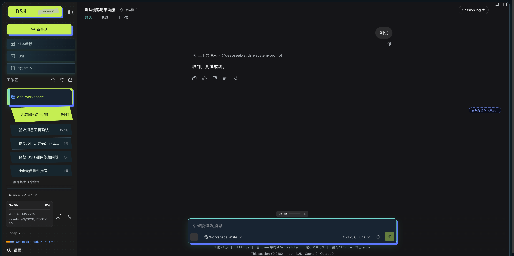
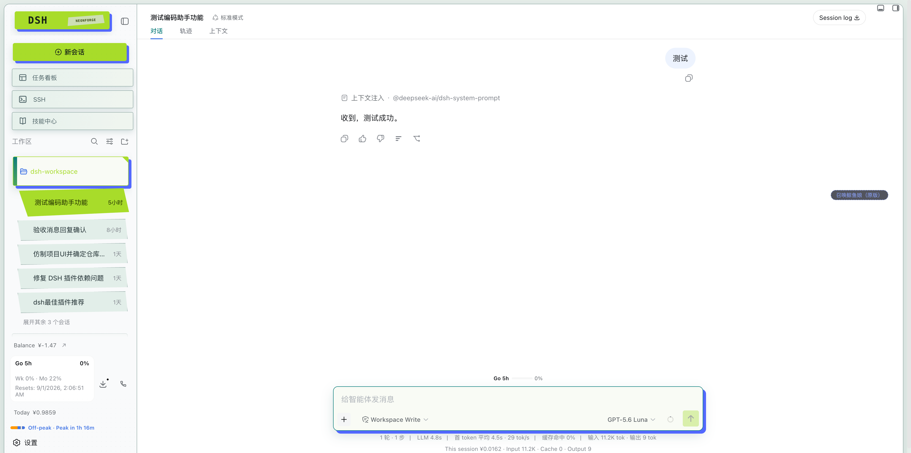

# DSH Neonforge

DSH Neonforge 是 DSH Web 工作台的独立视觉层实验仓库：保留原有 runtime、插件机制与会话能力，加入暗色工业控制台、荧光信号色和更强的状态层级。它不复制其他项目的代码、品牌、文案或素材。

设计说明见 [`docs/design/neonforge-ui.md`](docs/design/neonforge-ui.md)。

项目底稿、社区宣发稿和 Neonforge 专属文档见 [`docs/neonforge/README.zh.md`](docs/neonforge/README.zh.md)。

[English](README.md) | 中文

## 项目概览

Neonforge 是面向 DeepSeek Harness Web profile 的独立社区视觉皮肤。它改变工作台的呈现方式，同时保留 DSH 的会话、工具、权限、工作区、Agent runtime 和插件组合能力。

- 深色和浅色主题共享同一套后朋克工业控制台语言。
- 为工作区文件夹、会话、Composer 控件和运行状态提供更清晰的层级。
- 通过限定作用域的 CSS 和 DSH 扩展点加载，不替换宿主 runtime。
- 设置中提供皮肤开关，并支持 `prefers-reduced-motion`，适合长时间工作。





## 安装

```sh
dsh plugin --profile web add npm:@liyuk/dsh-neonforge
dsh web
```

启动后打开 DSH 设置，选择 **Neonforge 皮肤**，即可启用皮肤并切换深色或浅色模式。

项目底稿、设计说明、仓库结构和社区宣发稿见 [Neonforge 项目文档](docs/neonforge/README.md)。宣发稿提供[英文版](docs/neonforge/community-promo.md)和[中文版](docs/neonforge/community-promo.zh.md)。

DeepSeek Harness（`dsh`）是由 [DeepSeek AI](https://deepseek.com) 开发的开源 agent harness（智能体框架）。

它采用**一切皆插件**的架构，并由 [Cordis](https://github.com/cordiverse/cordis) 驱动，其设计参见论文 [_A Programming Paradigm for Spatiotemporal Composability_](https://github.com/cordiverse/paper)。

## 开发者预览

DeepSeek Harness 目前处于 _开发者预览_ 阶段，正在快速迭代。**未来将出现破坏兼容性的变更。**

## 运行

### 通过 `npm` 运行

安装 `Node.js`，然后运行：

```sh
npx @deepseek-ai/dsh web
```

该命令默认会在 `http://127.0.0.1:3080` 启动 Web UI，本机启动时还会用默认浏览器打开页面。通过 SSH 启动时只打印宿主机 URL，因为本地转发地址由 SSH 客户端或编辑器持有。传入 `--no-open` 可仅运行服务器而不打开浏览器。详见 [Web UI 指南](docs/user/guide/index.md)。

### 从源码运行

如需从仓库源码运行：

```sh
git clone https://github.com/deepseek-ai/deepseek-harness.git
cd deepseek-harness
pnpm install
pnpm run build
pnpm dsh web
```

`pnpm run build` 会准备仓库产物。`pnpm dsh web` 会直接使用这些已构建产物，不会重新构建。

## 社区与支持

- 欢迎通过 [GitHub Discussions](https://github.com/deepseek-ai/deepseek-harness/discussions) 提交反馈或 bug 报告。
- 为你的插件仓库添加 [`dsh-plugin`](https://github.com/topics/dsh-plugin) 话题，便于被发现。
- 欢迎加入 DeepSeek Harness 企微群：扫码添加企微小助手并填写入群问卷，完成后小助手会邀请你入群。

<table>
  <thead>
    <tr>
      <th align="center">企微小助手</th>
      <th align="center">入群问卷</th>
      <th align="center">微信公众号</th>
    </tr>
  </thead>
  <tbody>
    <tr>
      <td align="center"></td>
      <td align="center"><a href="https://trtgsjkv6r.feishu.cn/share/base/form/shrcnIt5twSVdLGD52KJBckGCgg"></a></td>
      <td align="center"></td>
    </tr>
  </tbody>
</table>

## 参与贡献

参见 [CONTRIBUTING.md](CONTRIBUTING.md)。

## 开发

请先阅读[开发指南](docs/development.md)与[架构文档](docs/architecture.md)。

面向 agent：请遵循 [AGENTS.md](AGENTS.md)。

## 许可证

[MIT](LICENSE)

第三方依赖及其许可证见 [THIRD_PARTY_NOTICES.md](THIRD_PARTY_NOTICES.md)。
