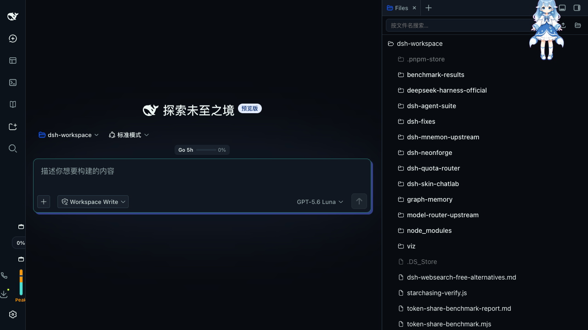
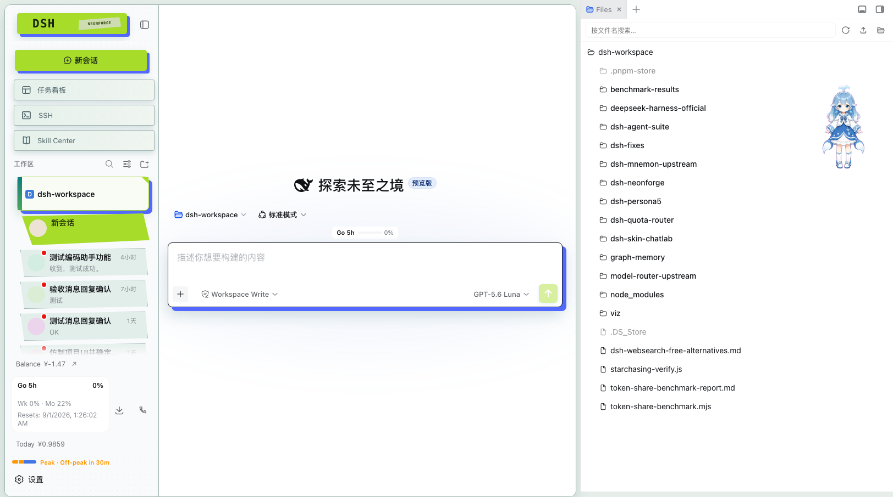

# DSH Neonforge

[English](README.md) | 中文

Neonforge 是 DeepSeek Harness Web 工作台的视觉皮肤插件。它保留 DSH 的会话、工具、权限、工作区和插件组合能力，只将基础界面改造成后朋克杂志拼贴式控制台。

## 特性

- 酸绿色操作控件与电蓝色错位印刷阴影。
- 深色工业表面、青色结构线、纸张标签和不规则任务票据。
- 更大的工作区卡片，包含文件夹状态、会话元信息、折角和选中动画。
- 输入框与主按钮共享同一套错位印刷语言。
- 设置面板提供皮肤开关，以及深色和浅色两套配色。
- 任务切换和运行指示支持 `prefers-reduced-motion`。

## 截图

### 深色控制台



### 浅色纸张与油墨皮肤



深色适合长时间运行和低光环境。浅色使用冷纸张灰、深墨文字、黄绿色油墨和青色结构线，同时保留蓝色错位阴影，让两种模式保持同一品牌识别。

## 安装到 DSH

```sh
dsh plugin --profile web add npm:@liyuk/dsh-neonforge
dsh web
```

本地开发时可以使用 checkout 链接：

```sh
dsh plugin --profile web add link:./plugins/dsh-neonforge
pnpm run build:neonforge-plugin
dsh web
```

包通过 `cordis.patch.yml` 暴露 DSH patch bundle。客户端入口位于 DSH runtime、UI slots 和 UI theme 之后，只负责基础组件的视觉层，不替换会话或 Agent runtime。

## 设置与主题

打开 DSH 设置，选择 **Neonforge 皮肤**：

- 皮肤开关关闭后会移除 Neonforge 标记，并恢复之前的 DSH 主题偏好。
- 深色和浅色按钮直接代理 DSH 原生主题设置；当 DSH 仍是“跟随系统”时，Neonforge 首次启用默认切到深色，之后跟随 DSH 的每次主题变化。

Neonforge 不修改模型、Provider、权限、工作区或会话数据，只提供 DSH 基础组件的呈现层。

## 设计语言

Neonforge 不是通用的霓虹发光主题。它参考后朋克 zine 排版、工业标签、终端状态信号和 90 年代印刷套色偏移。

| Token 分组 | 深色 | 浅色 |
| --- | --- | --- |
| 画布 | 墨蓝黑 | 冷纸张灰 |
| 主操作 | 酸绿 | 黄绿色油墨 |
| 辅助信号 | 青色 | 深青色 |
| 错位层 | 电蓝 | 电蓝 |
| 文字 | 淡薄荷色 | 深墨色 |

## 兼容性

- DSH Web profile。
- 使用当前 DSH 版本支持的 Node.js 版本。
- 插件依赖 DSH 基础 UI 的 data 属性和 ARIA 状态约定。上游组件角色或标签变化时，该组件可能暂时回退到普通 DSH 外观。

## 开发

```sh
pnpm install
pnpm run build:neonforge-plugin
pnpm exec vitest run packages/client/ui-theme/tests/client-styles.client.spec.ts packages/client/ui-conversation/tests/input-bar.client.spec.tsx packages/client/ui-workspace/tests/workspace-browser.client.spec.tsx packages/client/ui-sidebar/tests/sidebar-root.client.spec.tsx
```

生成的客户端产物是 `lib/client.js`。修改 `packages/client/ui-theme/src/styles/neonforge.css` 后需要重新运行构建脚本。

## 许可证

MIT。Neonforge 是独立的社区插件，不是 DeepSeek 官方产品。
