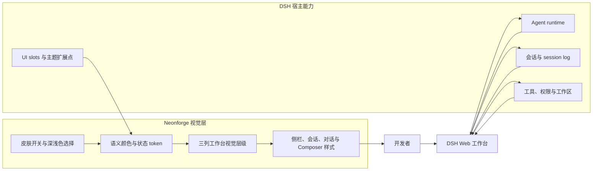
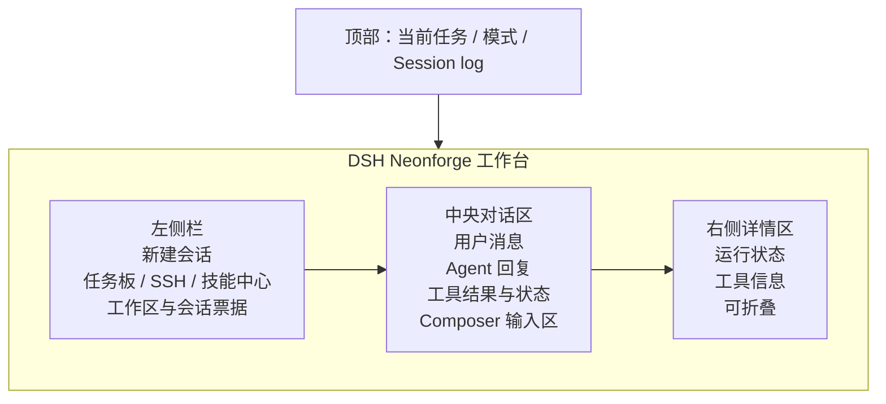

# DSH Neonforge 项目说明底稿

本文是 DSH Neonforge 的对外写作底稿，面向 Blog、DeepSeek Harness 社区介绍、项目发布帖和演示文案。它记录项目当前可验证的定位、实现范围、设计语言和使用方式，不是完整用户教程，也不替代项目 README 或 UI 设计参考。

## 视觉预览

下面两张图就是本项目当前的核心视觉方向：同一套工作台结构分别使用深色控制室和浅色纸张与油墨主题。截图中的会话名称、模型名称、余额、耗时和输入内容属于演示环境，不代表 Neonforge 单独提供这些能力。


## 一句话介绍

DSH Neonforge 是 DeepSeek Harness Web 工作台的独立社区视觉皮肤：不改动 DSH 的 Agent runtime、会话、工具、权限和插件组合，只用一套后朋克杂志拼贴与工业控制台语言，重新组织开发者与 Coding Agent 协作时看到的工作界面。

## 项目定位

DeepSeek Harness（DSH）提供了一个可组合的 Agent 工作台。它的核心特点是“一切皆插件”：会话、工具、权限、工作区和模型交互由运行时负责，Web UI 则负责把这些状态呈现给使用者。

Neonforge 选择从视觉层进入这个系统。它不是一个新的 Agent，不是 DSH 的替代运行时，也不是对 DSH 功能的重新实现；它是一层可以安装、关闭和移除的 Web UI 皮肤，让原本偏中性的工作台拥有更强的身份感、状态感和工作氛围。

项目名称中的 “Neon” 指向荧光信号色，“forge” 指向持续加工代码和工具的工作台。两者组合起来，表达的是一个带有工业控制室气质的 Agent 编程环境，而不是单纯的霓虹发光主题。

## 它解决什么问题

Coding Agent 工作台同时承载对话、文件工作区、工具调用、权限模式、运行状态和多个会话。功能越多，界面越容易退化成一组缺少层级的面板：用户能完成任务，却不容易快速判断当前所在位置、哪个任务正在运行、哪个状态需要注意。

Neonforge 主要解决三个视觉层问题：

- 让工作区、会话和当前任务具有更清晰的层级关系。
- 让运行、等待、完成、错误和中断等状态拥有一致且可识别的信号。
- 让长时间使用的开发环境形成稳定的视觉身份，同时保持对话内容和实际操作优先。

它不通过增加功能数量来解决这些问题，而是通过颜色、结构线、折角、状态标签、硬边偏移和留白重新分配注意力。

## 当前实现

### 工作台外观

Neonforge 为 DSH Web 工作台提供深色和浅色两套配色。深色模式使用墨蓝黑背景、工业灰蓝表面、淡薄荷色文字、酸绿色主操作色、青色健康信号和电蓝色偏移阴影；浅色模式改用冷纸张灰和深墨文字，但保留黄绿色操作色、青色结构线和电蓝偏移层。

界面保留 DSH 原有的工作台结构：侧栏承载导航、工作区和会话列表；中央区域承载对话和输入框；详情区域承载运行与工具信息。Neonforge 改变的是视觉层级和组件呈现，不替换这套布局、交互和数据流。

### 重点区域

- 侧栏使用更明确的导航选中态、工作区文件夹状态、会话票据式列表和底部工具区。
- 对话区域保持安静，让模型回复和用户输入成为主要内容。
- Composer 输入区域与主操作按钮使用统一的酸绿色操作色和短硬边阴影。
- 工具、队列、运行和错误状态使用统一的状态颜色与紧凑信息卡片表达。
- 设置中提供 Neonforge 皮肤开关，以及深色和浅色模式选择。
- 任务切换、运行指示和选中态支持 `prefers-reduced-motion`，减少动态偏好会关闭装饰性过渡和闪烁。

### 与 DSH 的关系

Neonforge 通过 DSH 的插件和主题扩展点加载，客户端入口位于 DSH runtime、UI slots 和 UI theme 之后。样式选择器主要限定在 `body[data-dsh-neonforge]` 或 Neonforge 专属标记下，以减少对基础 UI 和其他插件的影响。

启用 Neonforge 不会改变模型、Provider、权限、工作区数据、会话数据或 Agent 行为。关闭皮肤后，界面可以回到 DSH 原有主题偏好；Neonforge 的主题按钮也代理 DSH 原生主题设置，而不是建立一套独立的主题数据源。

## 设计图

这张图可以直接放进 Blog，用来解释 Neonforge 如何位于 DSH 的运行时与用户体验之间：



如果要表达截图中的页面布局，可以使用下面这张简化线框图：



## 设计思路

### 1. 先保留任务结构，再改变视觉性格

截图里的三列结构不是 Neonforge 重新发明的布局，而是 DSH 工作台已有的任务组织方式。Neonforge 保留侧栏、对话和详情区的职责，让用户不需要重新学习操作路径；它只重新安排颜色、对比度、边界和选中态，让同一套结构更像一个持续运行的工程控制台。

### 2. 用“信号”代替装饰

酸绿色不是单纯的品牌色，而是主操作信号；青色代表连接、健康和完成；黄色代表等待和注意；洋红色代表错误、中断和危险；电蓝色主要承担套色偏移和层级强调。颜色因此与状态绑定，用户看到颜色时可以推断它的操作含义。

### 3. 让对话成为安静的中心

Agent 工作台最重要的内容仍然是用户任务、模型回复和工具结果。侧栏可以更有性格，按钮可以更鲜明，但中央对话区不能被装饰抢走注意力。因此 Neonforge 把更强的形状和阴影集中在导航选中态、主操作和状态节点上，内容区域使用更安静的表面和细分隔线。

### 4. 把复杂状态拆成可扫描的层级

工作区、会话、工具调用、队列、权限和模型交互同时出现时，用户通常不是缺少信息，而是缺少信息层级。Neonforge 使用“位置 + 形状 + 文字 + 颜色”的组合表达状态：侧栏说明我在哪里，对话区说明发生了什么，详情区说明系统如何运行，输入区说明我下一步能做什么。

### 5. 用低成本的视觉层验证插件架构

这个项目还有一个工程实验目标：验证 DSH 的插件系统能否支持完整的视觉主题，而不需要复制宿主 runtime 或重写整套 Web 应用。Neonforge 通过 patch bundle、主题安装器、语义 token 和稳定 UI 标记完成适配，把行为所有权留在 DSH，把视觉表达所有权交给插件。

### 6. 让风格可以长期使用

后朋克、工业和赛博朋克元素很容易变成高亮、发光和动效堆叠。Neonforge 的取舍是保留少量高能信号，把其余区域压低噪声；使用短硬边阴影而不是到处使用模糊阴影；通过 `prefers-reduced-motion` 关闭装饰性动画。目标不是让页面每一秒都吸引注意，而是让用户连续工作几个小时后仍然知道界面在表达什么。

## 设计语言

Neonforge 的视觉参考来自后朋克 zine 排版、工业标签、终端状态信号和 1990 年代印刷套色偏移。它刻意避开“所有元素都发光”的通用赛博朋克风格，优先建立一个能长期工作的本地控制室。

设计原则如下：

1. 内容优先。对话和输入始终拥有最多的空间与最稳定的对比度。
2. 状态可读。状态不仅靠颜色表达，还配合文字、边框、图形或位置变化。
3. 结构清楚。使用细结构线、紧凑标签、有限的折角和少量硬边阴影建立层级。
4. 强调有限。酸绿、电蓝、青色和洋红色只在操作、焦点、健康、等待和危险状态中承担信号职责。
5. 交互不变。视觉皮肤不夺取指针输入，不改变原有按钮语义、会话动作、权限流程或响应式布局。
6. 可持续使用。动画短促且可关闭，圆角和阴影保持克制，避免把每一张卡片都变成视觉噪声。

## 为什么做成插件

DSH 的插件架构让视觉实验可以和 Agent 能力解耦。使用者可以保留已经熟悉的 DSH 工作流，只替换界面表达；开发者也可以在不复制 DSH runtime 的前提下，验证一套新的工作台视觉语言。

这种方式还保留了较低的试错成本：Neonforge 可以独立发布、安装、关闭和迭代；基础 DSH 继续负责会话、权限、工具和模型交互；其他插件仍然可以在同一个工作台中运行。

## 安装与体验

Neonforge 当前发布包名为 `@liyuk/dsh-neonforge`，目标平台是 DSH Web profile：

```sh
dsh plugin --profile web add npm:@liyuk/dsh-neonforge
dsh web
```

本地开发可以从仓库链接安装：

```sh
dsh plugin --profile web add link:./plugins/dsh-neonforge
pnpm run build:neonforge-plugin
dsh web
```

进入 DSH Web 后，在设置中选择 Neonforge 皮肤，再切换深色或浅色模式即可观察效果。完整安装说明和兼容性说明见 [插件 README](plugins/dsh-neonforge/README.zh.md)，视觉 token、组件适配和隔离规则见 [Neonforge UI 设计参考](docs/design/neonforge-ui.zh.md)。

## 适合对外强调的价值

对开发者而言，Neonforge 展示了 DSH 插件系统不仅可以扩展 Agent 的工具和能力，也可以扩展工作台本身的视觉表达。

对设计和前端开发者而言，它提供了一个具体案例：不复制宿主应用的 runtime，也不重写完整前端，只通过主题层、稳定标记和已有 UI 扩展点，就能为复杂 Agent 工作流建立一套完整的视觉系统。

对 DSH 社区而言，它是一个独立、可安装、可讨论的社区实验，适合用来探索“Agent 工作台应该是什么样子”，以及如何让状态密集型工具在保持可用性的同时拥有更明确的产品性格。

## 推荐的 Blog 叙事结构

### 1. 从真实使用场景开始

Coding Agent 工作台不是普通聊天窗口。它同时包含会话、工作区、工具、权限和运行状态，因此视觉设计需要帮助用户理解“我在哪里、当前发生了什么、下一步可以做什么”。

### 2. 提出 Neonforge 的回答

Neonforge 没有重做一个 Agent，而是把 DSH 现有工作台当成运行基础，通过插件化视觉层加入工业控制室、后朋克 zine 和套色偏移的视觉语言。

### 3. 展示设计取舍

重点解释内容优先、状态可读、强调有限和交互不变。可以用深色与浅色截图对比说明：配色改变了氛围，但三列工作台、对话、输入框和状态语义仍然属于 DSH。

### 4. 解释技术实现

说明 Neonforge 通过 patch bundle 和主题样式注入加载，使用稳定的 UI 标记与语义 token，尽量避免依赖生成类名或无归属的全局选择器；同时强调它不修改会话和 Agent runtime。

### 5. 以社区邀请结尾

邀请读者安装体验、反馈哪些状态最需要被看见、分享自己的 DSH 主题想法，或基于 DSH 插件机制构建新的工作台扩展。

## DSH 社区宣发稿

正式发布版本已单独保存为 [DSH｜Neonforge｜后朋克工业控制台视觉皮肤](docs/neonforge/community-promo.zh.md)，包含社区免责声明、截图、安装命令、集成边界和反馈问题。

## 可直接改写的短介绍

DSH Neonforge 是一个为 DeepSeek Harness Web 工作台制作的独立社区视觉皮肤。它保留 DSH 原有的会话、工具、权限、工作区和插件能力，只通过主题层和 UI 扩展点，把中性的工作界面改造成一座后朋克杂志拼贴风格的工业控制台：酸绿色操作、青色运行信号、电蓝色套色偏移、纸张标签和任务票据共同构成新的工作氛围。Neonforge 支持深色与浅色模式，也支持关闭皮肤并回到 DSH 原有主题。

## 对外表述边界

- 可以说“独立社区插件”“视觉皮肤”“视觉层适配”“基于 DSH 插件机制构建”。
- 可以说它保留 DSH 的会话、工具、权限、工作区和插件组合能力，因为这些属于宿主运行时和基础 UI。
- 不要说它是 DeepSeek 官方产品、官方主题或 DSH 的官方 redesign。
- 不要暗示它提供新的模型、Agent 能力、权限能力或会话存储。
- 不要把截图中的“测试编码助手”、余额、耗时或模型名称写成 Neonforge 自己提供的功能；这些属于截图所示的 DSH 工作台环境或演示状态。
- 如需提及视觉参考，应说明 Neonforge 使用独立 token、布局比例、组件样式、文案和素材，不复制其他项目的代码、品牌标志、图像、字体或产品命名。

## 项目事实索引

| 事实 | 当前信息 |
| --- | --- |
| 项目名称 | DSH Neonforge |
| 项目类型 | DSH Web 独立社区视觉皮肤插件 |
| npm 包 | `@liyuk/dsh-neonforge` |
| 目标 profile | DSH Web |
| 主题 | Dark、Light |
| 许可证 | MIT |
| 仓库 | [github.com/Liyuk/dsh-neonforge](https://github.com/Liyuk/dsh-neonforge) |
| 宿主项目 | [DeepSeek Harness](https://github.com/deepseek-ai/deepseek-harness) |
| 视觉参考文档 | [docs/design/neonforge-ui.zh.md](docs/design/neonforge-ui.zh.md) |

## 后续可以继续讨论的方向

这些方向适合在社区讨论或后续版本中展开，不应写成当前已交付能力：更多工作台状态的可视化、插件作者可复用的 Neonforge 语义 token、更多布局密度选项、对窄屏和远程开发场景的持续优化，以及围绕 Agent 运行状态建立更完整的可观察性表达。

## 相关文档

- [项目 README](README.zh.md)
- [插件 README](plugins/dsh-neonforge/README.zh.md)
- [Neonforge UI 设计参考](docs/design/neonforge-ui.zh.md)
- [Boujoy Harness 设计分析与适配护栏](docs/design/boujoy-harness-design-analysis.zh.md)
